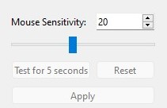

# DualShockPCController

Table of contents: 
- [DualShockPCController](#dualshockpccontroller)
  * [1 - Summary](#1---summary)
  * [2 - Features](#2---features)
    + [2.1 - Basic controls](#21---basic-controls)
    + [2.2 - Custom commands using personalized button sequence](#22---custom-commands-using-personalized-button-sequence)
    + [2.3 - Change controller's lightbar](#23---change-controller-s-lightbar)
    + [2.4 - Gyro mouse control](#24---gyro-mouse-control)
    + [2.5 - Change mouse sensitivity](#25---change-mouse-sensitivity)
    + [2.6 - Haptic feedback](#26---haptic-feedback)
    + [2.7 - Automatic saving](#27---automatic-saving)
  * [3 - Dependencies](#3---dependencies)

## 1 - Summary
This application allows you to control a PC using a DualShock 4 controller (Playstation 4 controller). The design was inspired by Grand Theft Auto V's control of a computer during a game. :) 

I developed this project to practice my programming skills. This project is incomplete (but still usable) and will no longer receive updates. You are welcome to clone it and improve it!

Do not hesitate to contact me on [LinkedIn](http://www.linkedin.com/in/banujan-atputharajah-556498222) if you want to discuss about this project.

## 2 - Features
Upon opening the application, DualShock PC Controller will automatically connect to the first DualShock 4 controller it finds (whether connected to bluetooth or by USB). If the application could not connect to a controller, you will see the following screen:

> ** Note : There's a bug where the "Reconnect" button does not work and will not try to search for a controller. For now, close the application, connect your DS4 controller and then open DualShock PC Controller.

Otherwise, you see will the following screen with all the buttons clickable:

### 2.1 - Basic controls
While you have the DualShock PC Controller opened, you can use the following button scheme to control your PC:

X : Left mouse click
SQUARE: 

| Button  | Action  | Usage example
|---|---| --- |
| X | Left mouse click | 
| SQUARE | Maximize  window |
| TRIANGLE | Minimize  window |
| CIRCLE | Close Window |
| L1 | Navigation back | Previous page in Chrome, Windows Explorer
| L2 + Left DPAD | Media previous song | Previous song in Spotify
| L2 + Right DPAD | Media next song | Next song in Spotify
| L2 + Up DPAD | Volume up |
| L2 + Down DPAD | Volume down |
| L2 + Down DPAD (Long press) | Mute / Unmute audio |
| L2 + X | Media play/pause | Play/Pause song in Spotify
| R1 | Navigation forward | Next page in Chrome, Windows Explorer
| R2 | Enter button |
| Left DPAD | Left arrow key |
| Right DPAD | Right arrow key |
| Up DPAD | Up arrow key |
| Down DPAD | Down arrow key |
| L3 (press) | Left mouse click  |
| R3 (press) | Right mouse click  | Show context menu 
| Left joystick | Move mouse
| Right joystick | Horizontal / vertical scroll bar | Scroll page on website, zoom in/out on Google Maps
| Center touchpad (long press) | Center mouse on screen |

### 2.2 - Custom commands using personalized button sequence
This is a powerful feature of DualShock PC Controller. It allows you to open programs with a button sequence. Here's an example showing you how to open Google Chrome with the button sequence TRIANGLE + SQUARE + CRICLE.

On the main screen, click on the "Add New Sequence" button. This will open the following dialog:

Enter the name of your command. Example : "Open Chrome". For the action type, select "Open file or program". A window will open asking you to select your program. In our example, we will select the file  ***C:\Program Files\Google\Chrome\Application\chrome.exe***

> For now, only the action type "Open file or program" is supported.

Now is the time to assign your button sequence. You have 2 options: 
1. Select your buttons from the drop down list and click "Add Button To Sequence" to add them.
2. Add them directly with the DS4 controller with the "Add Buttons with DualShock" button. (coolest way)

If you select option 2, you will have 3 seconds for every new button to add it to the sequence. Anything you press on your controller will be used for the command sequence. After the timeout, you will be able to use your controller normally again.

For this example, we will press TRIANGLE, SQUARE and CRICLE in succession.

The buttons have been added to the sequence! Click Ok to add save the sequence. On the main menu, you should see your new "Open Chrome" command available:

If you want to execute your command sequence, you press OPTIONS followed by your sequence. In our case, we will press OPTIONS + TRIANGLE + SQAURE + CIRCLE. If you configured everything properly, you should see a fresh page of Google Chrome in front of you!

> For the devs: This custom button sequence feature is implemented using a tree of hashmaps which helps retrieve a command with a complexity of O(1). Inserting a command has a complexity of O(n).

### 2.3 - Change controller's lightbar
DualShock PC controller allows you to customize the light bar color. This is done with the following UI on the main screen:

You have 2 options:
1. Choose a single color. You can click on the "Choose Color" button to select another color.
2. Random color on every button press. 

### 2.4 - Gyro mouse control
Put DualShock 4's gyroscope to good use and let it move your mouse ! Use the checkbox on the lower left side of the main screen to enable this feature. 

### 2.5 - Change mouse sensitivity
If you find your mouse is moving too fast or slow using the left joystick, you can adjust the speed using the following UI on the center bottom part of the main screen:

### 2.6 - Haptic feedback
On lower right side of the main screen, you can turn on and adjust haptic feed back. Everytime you press a button on the controller, you will feel a vibration.

### 2.7 - Automatic saving
DualShock PC Controller automatically saves your settings and will remember them the next time you open the application. This will save you some time! :)

> For the devs: this feature is implemented by serializing the settings into a file called "DUALSHOCKPCCONTROLLER_DATA.dat". This file should be in the current directory of the executable. 

## 3 - Dependencies
This section is for the devs looking to improve DualShock PC Controller.

This project has the following dependencies:
- Qt
- Boost
- JoyShockLibrary (included in this repository)

The Boost library is included in the VS project using an environment variable. My library was installed on separate drive. Here's how to set it up for your system (you can skip this if your Boost library is in the default include path):

1. Open Start menu, type "Environment Variables"
2. Click on "Edit the system environment variables"
3. In the advance tab, click on "Environment Variables" button
4. In the user variable add a new variable called "BOOST_INCLUDE"
5. In the variable value, type the path to the Boost includes. Should be something like "C:\Program Files\boost\boost_1_76_0"
6. In the user variable add a new variable called "BOOST_LIB"
7. In the variable value, type the path to the Boost libs. Should be something like "C:\Program Files\boost\boost_1_76_0\stage\lib"
8. This project is already configured to use these variables. You should be able to compile now.

You can contact me on [LinkedIn](http://www.linkedin.com/in/banujan-atputharajah-556498222) for assistance.